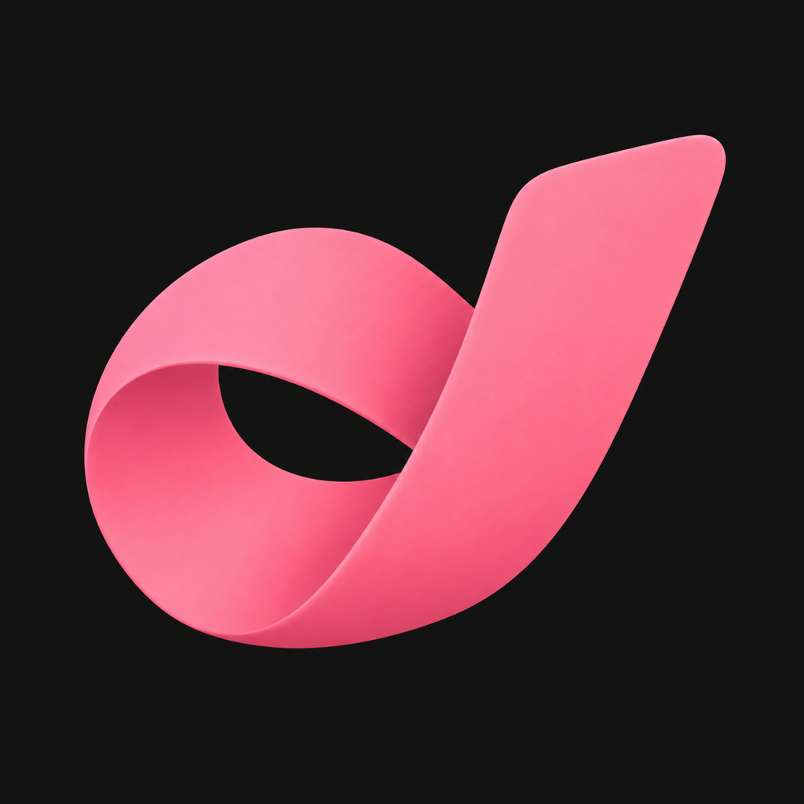

# 下次一定 · iPhone 本地版

使用 SwiftUI + WKWebView 加载随 App 一起安装的本地界面文件，无需部署网址或依赖本地预览服务器。约定与邀约草稿保存在设备上的 WKWebView 持久化存储内。复制邀约通过原生剪贴板完成。

界面主色为参考图取样的 `#FE7B9B`，保留自定义天、小时、分钟，以及手动标记邀约状态的流程。

Build 3 使用黑底粉色回环桌面图标。生成原图保存在 `design/app-icon-v2.png`，发布资源为 `NextTime/Assets.xcassets/AppIcon.appiconset/AppIcon.png`（1024 × 1024、无透明通道）。



## 项目

- Xcode 项目：`NextTime.xcodeproj`
- Bundle ID：`com.nexttime.pocket.l01a10115`
- 最低系统：iOS 17
- 本地资源：`NextTime/Web/`
- 已构建产物：`build/Build/Products/Debug-iphoneos/NextTime.app`

使用 Xcode 的自动签名选择自己的团队后构建，并安装到连接的 iPhone。免费 Personal Team 受 Apple 的应用数量和签名期限限制。

## IPA 安装包

`releases/NextTime-1.0-3.ipa` 是已签名的开发版安装包；校验值和签名有效期见同目录的 `.sha256`、`.json` 文件。

当前包仅授权已经登记的 1 台 iPhone，最低支持 iOS 17。签名有效期至 **2026-10-11 00:05:35（北京时间）**。其他设备需使用自己的 Xcode 团队重新签名。IPA 不能像普通下载文件一样在 Safari 中直接点开安装。

通过已安装 Xcode 的 Mac 安装：

```sh
# 查看已连接手机的标识
DEVELOPER_DIR=/Applications/Xcode.app/Contents/Developer xcrun devicectl list devices

# 替换 IPHONE_IDENTIFIER 为手机标识，覆盖更新会保留该 App 的数据容器
python3 scripts/install_ipa.py releases/NextTime-1.0-3.ipa --device IPHONE_IDENTIFIER --launch
```

手机需信任这台 Mac，并开启开发者模式。也可以通过 Apple Configurator 导入 IPA。

## 重新构建与打包

先在 Xcode 的 Signing & Capabilities 中选择自己的 Team，或执行：

```sh
DEVELOPER_DIR=/Applications/Xcode.app/Contents/Developer xcodebuild \
  -project NextTime.xcodeproj -scheme NextTime -configuration Debug \
  -destination 'generic/platform=iOS' -derivedDataPath build \
  -allowProvisioningUpdates DEVELOPMENT_TEAM=YOUR_TEAM_ID build

python3 scripts/package_ipa.py
```

打包脚本会校验签名，生成 IPA，重新解包校验签名及逐文件内容，并生成 SHA-256 和有效期信息。私钥、证书导出文件、原始描述文件和构建缓存不入库；已签名 IPA 作为交付产物保存在 `releases/`。

## 检查

- Xcode 实机目标 Debug 构建成功。
- Build 2 于 2026-10-04 通过 devicectl 安装到连接的 iPhone 16 Pro，并成功启动。
- Build 3 已完成新图标构建、IPA 签名与解包完整性校验。
- 本地资源引用和 JavaScript 语法检查通过。
- 可用 `node --check NextTime/Web/app.js` 检查交互脚本语法；打包脚本负责 IPA 完整性与签名检查。

卸载应用会移除本地记录。此版本不跨设备同步。

内置 Lucide 0.468.0，ISC 许可见 `NextTime/Web/lucide-LICENSE.txt`。本仓库不包含 Apple 签名私钥。
